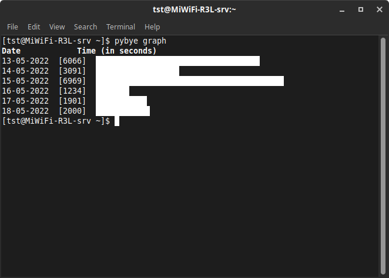

# pybye

Python version of [byeBye](https://github.com/sriteja-t/byeBye)

Shutdown the computer, logs date and uptime, visualize the logged data in terminal.

## How to install

Copy and paste the following commands in your terminal:

``pip install termplotlib``

``cd /usr/local/bin``

``sudo wget https://raw.githubusercontent.com/Sriram-bb63/pybye/main/pybye``

``sudo chmod +x pybye``

## Run

Run pybye using ``pybye`` from any directory in your terminal.

Run ``pybye graph`` to see a graph of total uptime for each day.

> **_NOTE:_**  pybye will only log data if you use ``pybye`` command to shutdown your computer. Any other methods used will not log uptime thus creating incorrect data which will be used by the graph making it inaccurate.
